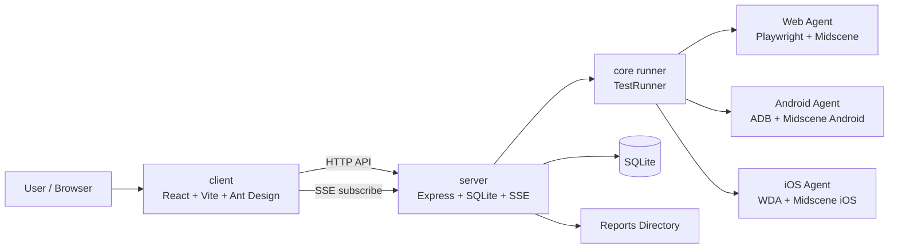

# Scenix

AI-driven UI automation testing platform built on Midscene.js and Appium.  
基于 Midscene.js 和 Appium 的 AI 驱动 UI 自动化测试平台。

Scenix lets you write natural-language test cases, organize them into suites, execute them across Web / Android / iOS, and review suite-level reports with per-case drill-down.  
Scenix 支持使用自然语言编写测试用例，将多个用例编排为测试套件，在 Web / Android / iOS 上执行，并以“套件总报告 + 子用例报告”的方式查看结果。

> Windows and macOS are supported for deployment. iOS execution requires macOS.  
> 项目支持部署在 Windows 和 macOS；其中 iOS 执行仅支持 macOS。

## Highlights | 核心能力

- Natural-language UI testing  
  自然语言 UI 自动化测试
- Suite-based execution model  
  基于测试套件的执行模型
- Web / Android / iOS support  
  支持 Web / Android / iOS
- Real-time execution updates via SSE  
  基于 SSE 的实时执行状态更新
- SQLite persistence  
  SQLite 持久化存储
- Suite report + per-case report  
  套件总报告 + 子用例报告
- Cross-platform path handling for Windows/macOS  
  面向 Windows / macOS 的跨平台路径处理

## Screenshots | 页面截图

UI screenshots placeholder:

```text
[ Dashboard Screenshot ]
[ Test Suites Screenshot ]
[ Reports Screenshot ]
```

可替换为真实图片，例如：

```md


```

## Architecture | 架构图



### Runtime Model | 运行模型

- Test cases are authored individually, but execution starts from a suite.  
  测试用例以单条方式编写，但执行入口是测试套件。
- A suite contains one or more cases of the same platform.  
  一个测试套件可包含一个或多个同平台测试用例。
- Reports are shown at suite level and can be expanded to child case reports.  
  报告以套件为主记录展示，可展开查看子用例报告。

## Core Concepts | 核心概念

### Test Case | 测试用例

A single natural-language automation flow.  
一条自然语言自动化流程。

Example | 示例:

```text
1. 打开首页
2. 点击搜索框
3. 输入 Midscene.js
4. 点击搜索按钮
5. 断言页面包含搜索结果
```

### Test Suite | 测试套件

A suite groups one or more test cases of the same platform.  
测试套件用于组织一个或多个同平台测试用例。

- Minimum 1 case per suite  
  一个套件至少包含 1 个用例
- All cases in the same suite must share the same platform  
  同一套件中的用例必须属于同一平台
- Execution order follows the case order inside the suite  
  执行顺序与套件中的用例顺序一致

### Test Run | 测试执行

A run is always started from a suite, not from a standalone case.  
测试执行始终从套件发起，而不是直接从单用例发起。

- Web suites run without a device  
  Web 套件不需要设备
- Android suites require an Android device  
  Android 套件需要 Android 设备
- iOS suites require an iOS device and configured WDA host/port  
  iOS 套件需要 iOS 设备以及配置好的 WDA host/port

## Tech Stack | 技术栈

| Layer | Tech |
|---|---|
| Frontend | React 18 + Ant Design + TypeScript + Vite |
| Backend | Express + TypeScript + better-sqlite3 |
| Core | Midscene.js + Appium |
| Workspace | pnpm workspace |

## Quick Start | 快速开始

### Requirements | 环境要求

- Node.js 18+
- pnpm 8+
- Windows 10/11 or macOS 13+
- macOS + Xcode + WebDriverAgent for iOS execution  
  iOS 执行需要 macOS + Xcode + WebDriverAgent

### Install | 安装

```bash
git clone <repository-url>
cd scenix
pnpm install
```

### Configure | 配置

```bash
# macOS / Linux
cp .env.example .env

# Windows PowerShell
Copy-Item .env.example .env
```

At minimum, configure:  
至少配置以下模型参数：

```env
MIDSCENE_MODEL_BASE_URL=...
MIDSCENE_MODEL_API_KEY=...
MIDSCENE_MODEL_NAME=...
MIDSCENE_MODEL_FAMILY=...
```

Useful options | 常用配置：

- `DATABASE_PATH=./server/data/app.db`
- `MIDSCENE_RUN_DIR=./reports/midscene`
- `MIDSCENE_CHROMIUM_EXECUTABLE_PATH=/path/to/chrome`
- `MIDSCENE_ADB_PATH=/path/to/adb` if `adb` is not in `PATH`
- `IOS_WDA_HOST` / `IOS_WDA_PORTS` for iOS execution

Notes | 说明：

- Android SDK env is inferred when possible; it does not need to be hardcoded into `.env`  
  Android SDK 环境会尽量自动推断，不需要把主机路径硬编码进 `.env`
- `MIDSCENE_REPLANNING_CYCLE_LIMIT` defaults to `3`  
  `MIDSCENE_REPLANNING_CYCLE_LIMIT` 默认值为 `3`
- UI time display is normalized to China time  
  页面中的时间统一按中国时间显示

### Run | 启动

```bash
pnpm dev
```

Or separately | 或分别启动：

```bash
pnpm dev:server
pnpm dev:client
```

Default endpoints | 默认地址：

- Frontend: `http://localhost:5173`
- Backend: `http://localhost:3001`

## Typical Workflow | 典型使用流程

1. Create test cases  
   创建测试用例
2. Create a test suite  
   创建测试套件
3. Run the suite  
   执行测试套件
4. Watch live updates  
   查看实时状态
5. Open suite report and child case reports  
   查看套件总报告和子用例报告

## Reports | 报告

Scenix stores reports under a single canonical run directory.  
Scenix 统一将报告写入单一规范目录。

- Default report directory: `./reports/midscene/report`
- Single-case suite: suite report points directly to the case report  
  单用例套件：套件报告直接指向该用例报告
- Multi-case suite: suite report opens a generated summary page with links to child reports  
  多用例套件：套件报告打开汇总页，页内链接到各子用例报告

## API Overview | API 概览

### Test Cases | 测试用例

| Method | Path |
|---|---|
| GET | `/api/test-cases` |
| GET | `/api/test-cases/:id` |
| POST | `/api/test-cases` |
| PUT | `/api/test-cases/:id` |
| DELETE | `/api/test-cases/:id` |

### Test Suites | 测试套件

| Method | Path |
|---|---|
| GET | `/api/test-suites` |
| GET | `/api/test-suites/:id` |
| POST | `/api/test-suites` |
| PUT | `/api/test-suites/:id` |
| DELETE | `/api/test-suites/:id` |

### Test Runs | 执行记录

| Method | Path |
|---|---|
| GET | `/api/test-runs` |
| GET | `/api/test-runs/:id` |
| POST | `/api/test-runs` |
| DELETE | `/api/test-runs/:id` |
| GET | `/api/test-runs/events` |

### Devices | 设备

| Method | Path |
|---|---|
| GET | `/api/devices` |
| POST | `/api/devices/refresh` |

## Storage | 存储

- Database: `./server/data/app.db`
- Reports: `./reports/midscene/report`
- Relative paths are resolved from the workspace root  
  相对路径统一按项目根目录解析

## Development | 开发

```bash
pnpm dev
pnpm build
pnpm test
pnpm test:web
pnpm test:android
pnpm test:ios
```

## Deployment | 部署

- Windows: frontend, backend, Web, Android
- macOS: frontend, backend, Web, Android, iOS
- iOS execution is macOS only  
  iOS 执行仅支持 macOS

## License | 许可证

Private project. Distribution without authorization is not permitted.  
私有项目，未经授权不得分发。
