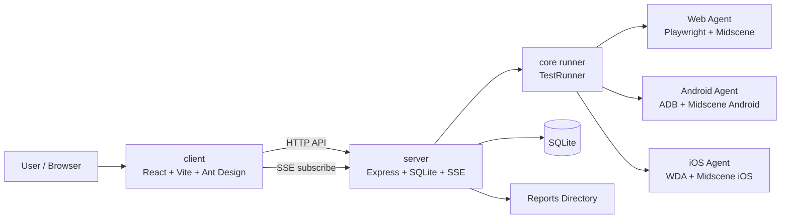

# Scenix

[English Version](./docs/README.en.md)

[](https://github.com/paynewinnt/scenix/actions/workflows/ci.yml)
[](./LICENSE)
[](./.github/CONTRIBUTING.md)

基于 Midscene.js 和 Appium 的 AI 驱动 UI 自动化测试平台。

Scenix 支持使用自然语言编写测试用例，将多个用例编排为测试套件，在 Web / Android / iOS 上执行，并以“套件总报告 + 子用例报告”的方式查看结果。

Scenix 是采用 [MIT License](./LICENSE) 的开源项目。任何人都可以使用、复制、修改和分发代码，也欢迎通过 Issue 和 Pull Request 参与改进。

> 项目支持部署在 Windows 和 macOS；其中 iOS 执行仅支持 macOS。

## 核心能力

- 自然语言 UI 自动化测试
- 基于测试套件的执行模型
- 基于 `queued` 的执行队列与资源调度
- 支持 Web / Android / iOS
- 基于 SSE 的实时执行状态更新
- SQLite 持久化存储
- 套件总报告 + 子用例报告 + 站内详情页
- 运行环境 readiness 诊断
- 面向 Windows / macOS 的跨平台路径处理

## 架构图



### 运行模型

- 测试用例以单条方式编写，但执行入口是测试套件。
- 一个测试套件可包含一个或多个同平台测试用例。
- 新执行会先进入 `queued`，再由服务端调度器按资源策略异步出队。
- `TestRun` 页面会展示同资源排队顺位与当前阻塞原因。
- 报告以套件为主记录展示，可展开查看子用例报告并进入站内详情页。

## 核心概念

### 测试用例

一条自然语言自动化流程。

示例：

```text
1. 打开 Bing 首页
2. 点击搜索框
3. 输入 Midscene.js
4. 点击搜索按钮，并等待进入 Midscene.js 搜索结果页
5. 断言搜索关键词为 Midscene.js，且至少显示一条相关结果
```

### 测试套件

测试套件用于组织一个或多个同平台测试用例。

- 一个套件至少包含 1 个用例
- 同一套件中的用例必须属于同一平台
- 执行顺序与套件中的用例顺序一致

### 测试执行

测试执行始终从套件发起，而不是直接从单用例发起。

- Web 套件不需要设备
- Android 套件需要 Android 设备
- iOS 套件需要 iOS 设备以及配置好的 WDA host/port

## 技术栈

| 层级 | 技术 |
|---|---|
| 前端 | React 18 + Ant Design + TypeScript + Vite |
| 后端 | Express + TypeScript + better-sqlite3 |
| 核心执行层 | Midscene.js + Appium |
| 工作区 | pnpm workspace |

## 快速开始

### 环境要求

- Node.js 18+
- pnpm 9+
- Windows 10/11 或 macOS 13+
- iOS 执行需要 macOS + Xcode + WebDriverAgent

### 安装

```bash
git clone https://github.com/paynewinnt/scenix.git
cd scenix
pnpm install
```

### 配置

```bash
# macOS / Linux
cp .env.example .env

# Windows PowerShell
Copy-Item .env.example .env
```

Scenix 支持现有 API Provider 和本机 Codex CLI 两种模型入口。API 模式保持向后兼容：

```env
MIDSCENE_MODEL_PROVIDER=api
MIDSCENE_MODEL_BASE_URL=...
MIDSCENE_MODEL_API_KEY=...
MIDSCENE_MODEL_NAME=...
# MIDSCENE_MODEL_FAMILY=...
```

使用本机 Codex 时，不需要模型 API Key；默认模型为 `gpt-5.4`，推理强度为 `medium`：

```bash
codex --version
codex login
codex login status
```

```env
MIDSCENE_MODEL_PROVIDER=codex
MIDSCENE_MODEL_BASE_URL=codex://local
MIDSCENE_MODEL_NAME=gpt-5.4
MIDSCENE_MODEL_FAMILY=gpt-5
MIDSCENE_MODEL_REASONING_EFFORT=medium
```

常用配置：

- `SERVER_HOST=127.0.0.1`，默认只允许本机访问
- `CORS_ORIGINS=http://localhost:5173,http://127.0.0.1:5173`
- `DATABASE_PATH=./server/data/app.db`
- `MIDSCENE_RUN_DIR=./reports/midscene`
- `MIDSCENE_CHROMIUM_EXECUTABLE_PATH=/path/to/chrome`
- `MIDSCENE_BROWSER_LOCALE=zh-CN`，需要让匿名测试浏览器使用中文区域时设置
- `MIDSCENE_BROWSER_TIMEZONE=Asia/Shanghai`，需要固定测试浏览器时区时设置
- `MIDSCENE_ADB_PATH=/path/to/adb`，当 `adb` 不在 `PATH` 中时使用
- `IOS_WDA_HOST` / `IOS_WDA_PORTS`，用于 iOS 执行

说明：

- Android SDK 环境会尽量自动推断，不需要把主机路径硬编码进 `.env`
- `MIDSCENE_REPLANNING_CYCLE_LIMIT` 默认值为 `3`
- 页面中的时间统一按中国时间显示
- 如果只配置 `OPENAI_API_KEY`，运行时会自动镜像为 Midscene 所需环境变量
- 本机 Codex 模式通过 `codex app-server` 复用当前 ChatGPT/Codex 登录；它仍需要网络和可用额度，不是离线模型
- readiness 会检查 Codex CLI、`app-server` 子命令和登录状态
- Playwright 每次执行都使用隔离的匿名浏览器上下文，不会自动继承日常 Chrome 的账号、Cookie、历史记录或扩展

### 启动

```bash
pnpm dev
```

也可以分别启动：

```bash
pnpm dev:server
pnpm dev:client
```

默认地址：

- 前端：`http://localhost:5173`
- 后端：`http://localhost:3001`

## 典型使用流程

1. 创建测试用例
2. 创建测试套件
3. 执行测试套件
4. 查看实时状态
5. 查看套件总报告和子用例报告
6. 在仪表盘或 `/api/readiness` 查看运行环境诊断

## 报告

Scenix 统一将报告写入单一规范目录。

- 默认报告目录：`./reports/midscene/report`
- 单用例套件：套件报告直接指向该用例报告
- 多用例套件：套件报告打开汇总页，页内链接到各子用例报告
- 前端报告详情页：`/reports/:runId`

## API 概览

### 测试用例

| 方法 | 路径 |
|---|---|
| GET | `/api/test-cases` |
| GET | `/api/test-cases/:id` |
| POST | `/api/test-cases` |
| PUT | `/api/test-cases/:id` |
| DELETE | `/api/test-cases/:id` |

### 测试套件

| 方法 | 路径 |
|---|---|
| GET | `/api/test-suites` |
| GET | `/api/test-suites/:id` |
| POST | `/api/test-suites` |
| PUT | `/api/test-suites/:id` |
| DELETE | `/api/test-suites/:id` |

### 执行记录

| 方法 | 路径 |
|---|---|
| GET | `/api/test-runs` |
| GET | `/api/test-runs/:id` |
| POST | `/api/test-runs` |
| DELETE | `/api/test-runs/:id` |
| GET | `/api/test-runs/events` |

### 设备

| 方法 | 路径 |
|---|---|
| GET | `/api/devices` |
| POST | `/api/devices/refresh` |

### 运行环境

| 方法 | 路径 |
|---|---|
| GET | `/api/readiness` |

## 存储

- 数据库：`./server/data/app.db`
- 报告：`./reports/midscene/report`
- 相对路径统一按项目根目录解析

## 开发

```bash
pnpm dev
pnpm build
pnpm test
pnpm test:unit
pnpm test:live
pnpm test:all
pnpm test:web
pnpm test:android
pnpm test:ios
```

`pnpm test:web` 会始终用 Chromium 验证本地搜索基线；配置好 `MIDSCENE_MODEL_*` 后，还会在真实 Bing 首页执行上述 Midscene 自然语言视觉流程。Android / iOS 属于真实设备测试，需要对应设备环境。

## 参与开源

任何 GitHub 用户都可以 fork 本仓库、创建 Issue，并向 `master` 提交 Pull Request。为保护项目和所有使用者，外部贡献通过评审和 CI 后由维护者合并，而不是开放匿名直接写入仓库。

- 开始贡献前请阅读 [贡献指南](./.github/CONTRIBUTING.md)
- 所有参与者都应遵守 [行为准则](./.github/CODE_OF_CONDUCT.md)
- 安全漏洞请按 [安全策略](./.github/SECURITY.md) 私密报告，不要创建公开 Issue
- Bug 与功能建议可通过 [GitHub Issues](https://github.com/paynewinnt/scenix/issues) 提交

## 部署

- Windows：frontend、backend、Web、Android
- macOS：frontend、backend、Web、Android、iOS
- iOS 执行仅支持 macOS
- 当前版本尚未提供身份认证，因此服务默认只监听 `127.0.0.1`
- 如确需局域网访问，必须同时设置 `SERVER_HOST=0.0.0.0`、`SCENIX_ALLOW_REMOTE=true` 和严格的 `CORS_ORIGINS`；请只在可信网络及防火墙保护下使用

## 许可证

本项目采用 [MIT License](./LICENSE)。你可以自由使用、复制、修改、合并、发布和分发本项目，但须保留原始版权和许可声明。
