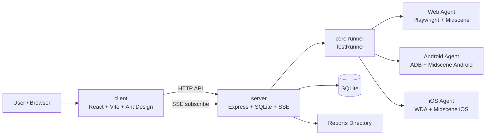

# Scenix

[中文说明](../README.md)

[](https://github.com/paynewinnt/scenix/actions/workflows/ci.yml)
[](../LICENSE)
[](../.github/CONTRIBUTING.en.md)

AI-driven UI automation testing platform built on Midscene.js and Appium.

Scenix lets you write natural-language test cases, organize them into suites, execute them across Web / Android / iOS, and review suite-level reports with per-case drill-down.

Scenix is open source under the [MIT License](../LICENSE). Everyone may use, copy, modify, and distribute the code, and contributions through Issues and Pull Requests are welcome.

> Windows and macOS are supported for deployment. iOS execution requires macOS.

## Highlights

- Natural-language UI testing
- Suite-based execution model
- `queued` execution queue with resource-aware scheduling
- Web / Android / iOS support
- Real-time execution updates via SSE
- SQLite persistence
- Suite report + per-case report + in-app detail page
- Runtime readiness diagnostics
- Cross-platform path handling for Windows/macOS

## Architecture



### Runtime Model

- Test cases are authored individually, but execution starts from a suite.
- A suite contains one or more cases of the same platform.
- New executions first enter `queued`, then the server-side scheduler dispatches them when resources are available.
- The `TestRun` page shows per-resource queue position and the current blocking reason for queued runs.
- Reports are shown at suite level and can be expanded to child case reports or opened in the in-app detail page.

## Core Concepts

### Test Case

A single natural-language automation flow.

Example:

```text
1. Open the Bing homepage
2. Click the search box
3. Enter Midscene.js
4. Click the search button and wait for the Midscene.js search results page
5. Assert the search query is Midscene.js and at least one related result is shown
```

### Test Suite

A suite groups one or more test cases of the same platform.

- Minimum 1 case per suite
- All cases in the same suite must share the same platform
- Execution order follows the case order inside the suite

### Test Run

A run is always started from a suite, not from a standalone case.

- Web suites run without a device
- Android suites require an Android device
- iOS suites require an iOS device and configured WDA host/port

## Tech Stack

| Layer | Tech |
|---|---|
| Frontend | React 18 + Ant Design + TypeScript + Vite |
| Backend | Express + TypeScript + better-sqlite3 |
| Core | Midscene.js + Appium |
| Workspace | pnpm workspace |

## Quick Start

### Requirements

- Node.js 18+
- pnpm 9+
- Windows 10/11 or macOS 13+
- macOS + Xcode + WebDriverAgent for iOS execution

### Install

```bash
git clone https://github.com/paynewinnt/scenix.git
cd scenix
pnpm install
```

### Configure

```bash
# macOS / Linux
cp .env.example .env

# Windows PowerShell
Copy-Item .env.example .env
```

Scenix supports both the existing API provider and a local Codex CLI provider. API mode remains backward compatible:

```env
MIDSCENE_MODEL_PROVIDER=api
MIDSCENE_MODEL_BASE_URL=...
MIDSCENE_MODEL_API_KEY=...
MIDSCENE_MODEL_NAME=...
# MIDSCENE_MODEL_FAMILY=...
```

Local Codex mode does not require a model API key. It defaults to `gpt-5.4` with `medium` reasoning effort:

```bash
codex --version
codex login
codex login status
```

```env
MIDSCENE_MODEL_PROVIDER=codex
MIDSCENE_MODEL_BASE_URL=codex://local
MIDSCENE_MODEL_NAME=gpt-5.4
MIDSCENE_MODEL_FAMILY=gpt-5
MIDSCENE_MODEL_REASONING_EFFORT=medium
```

Useful options:

- `SERVER_HOST=127.0.0.1` keeps the backend local-only by default
- `CORS_ORIGINS=http://localhost:5173,http://127.0.0.1:5173`
- `DATABASE_PATH=./server/data/app.db`
- `MIDSCENE_RUN_DIR=./reports/midscene`
- `MIDSCENE_CHROMIUM_EXECUTABLE_PATH=/path/to/chrome`
- `MIDSCENE_ADB_PATH=/path/to/adb` if `adb` is not in `PATH`
- `IOS_WDA_HOST` / `IOS_WDA_PORTS` for iOS execution

Notes:

- Android SDK env is inferred when possible; it does not need to be hardcoded into `.env`
- `MIDSCENE_REPLANNING_CYCLE_LIMIT` defaults to `3`
- UI time display is normalized to China time
- If only `OPENAI_API_KEY` is set, runtime defaults are mirrored into the Midscene env vars automatically
- Local Codex mode uses `codex app-server` with the current ChatGPT/Codex login; it still needs network access and available quota, and is not an offline model
- Runtime readiness checks the Codex CLI, its `app-server` subcommand, and login status

### Run

```bash
pnpm dev
```

Or separately:

```bash
pnpm dev:server
pnpm dev:client
```

Default endpoints:

- Frontend: `http://localhost:5173`
- Backend: `http://localhost:3001`

## Typical Workflow

1. Create test cases
2. Create a test suite
3. Run the suite
4. Watch live updates
5. Open suite report and child case reports
6. Review runtime diagnostics in the dashboard or `/api/readiness`

## Reports

Scenix stores reports under a single canonical run directory.

- Default report directory: `./reports/midscene/report`
- Single-case suite: suite report points directly to the case report
- Multi-case suite: suite report opens a generated summary page with links to child reports
- Frontend report detail route: `/reports/:runId`

## API Overview

### Test Cases

| Method | Path |
|---|---|
| GET | `/api/test-cases` |
| GET | `/api/test-cases/:id` |
| POST | `/api/test-cases` |
| PUT | `/api/test-cases/:id` |
| DELETE | `/api/test-cases/:id` |

### Test Suites

| Method | Path |
|---|---|
| GET | `/api/test-suites` |
| GET | `/api/test-suites/:id` |
| POST | `/api/test-suites` |
| PUT | `/api/test-suites/:id` |
| DELETE | `/api/test-suites/:id` |

### Test Runs

| Method | Path |
|---|---|
| GET | `/api/test-runs` |
| GET | `/api/test-runs/:id` |
| POST | `/api/test-runs` |
| DELETE | `/api/test-runs/:id` |
| GET | `/api/test-runs/events` |

### Devices

| Method | Path |
|---|---|
| GET | `/api/devices` |
| POST | `/api/devices/refresh` |

### Runtime Readiness

| Method | Path |
|---|---|
| GET | `/api/readiness` |

## Storage

- Database: `./server/data/app.db`
- Reports: `./reports/midscene/report`
- Relative paths are resolved from the workspace root

## Development

```bash
pnpm dev
pnpm build
pnpm test
pnpm test:unit
pnpm test:live
pnpm test:all
pnpm test:web
pnpm test:android
pnpm test:ios
```

`pnpm test:web` always verifies the local Chromium search baseline. When `MIDSCENE_MODEL_*` is configured, it also runs the documented Midscene natural-language visual flow against the real Bing homepage. Android and iOS tests require real device environments.

## Contributing

Every GitHub user may fork this repository, open an Issue, and submit a Pull Request to `master`. To protect the project and its users, maintainers merge external contributions after review and CI rather than granting anonymous direct write access.

- Read the [Contributing Guide](../.github/CONTRIBUTING.en.md) before starting
- Follow the [Code of Conduct](../.github/CODE_OF_CONDUCT.md) in all project spaces
- Report vulnerabilities privately under the [Security Policy](../.github/SECURITY.md), not in a public Issue
- Use [GitHub Issues](https://github.com/paynewinnt/scenix/issues) for bugs and feature proposals

## Deployment

- Windows: frontend, backend, Web, Android
- macOS: frontend, backend, Web, Android, iOS
- iOS execution is macOS only
- Authentication is not available yet, so the server listens on `127.0.0.1` by default
- For trusted-LAN access only, set `SERVER_HOST=0.0.0.0`, `SCENIX_ALLOW_REMOTE=true`, and a restrictive `CORS_ORIGINS` allowlist; keep the service behind a firewall

## License

This project is licensed under the [MIT License](../LICENSE). You may use, copy, modify, merge, publish, and distribute it as long as the original copyright and license notice are retained.
